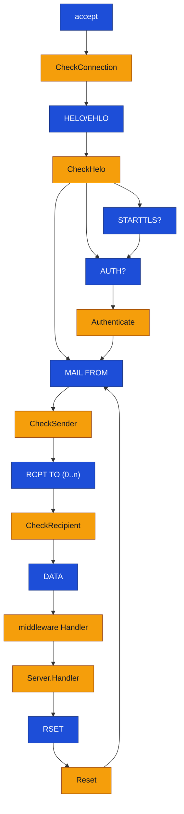

Go smtpd v2 [](https://pkg.go.dev/github.com/chrj/smtpd/v2)
========

Package `smtpd` implements an SMTP server in Go.

Versions
--------

| Version | Status | Branch | Tag | Docs |
|---------|--------|--------|-----|------|
| v1 | stable | [`v1`](https://github.com/chrj/smtpd/tree/v1) | [`v1.0.0`](https://github.com/chrj/smtpd/releases/tag/v1.0.0) | [godoc](https://pkg.go.dev/github.com/chrj/smtpd) |
| v2 | stable | [`main`](https://github.com/chrj/smtpd/tree/main) | [`v2.2.0`](https://github.com/chrj/smtpd/releases/tag/v2.2.0) | [godoc](https://pkg.go.dev/github.com/chrj/smtpd/v2) |

v1 is the original battle-tested API.

```go
import "github.com/chrj/smtpd"
```

v2 is a ground-up rewrite of the v1 API. It keeps the same wire behavior but
restructures the programming model around `context.Context`, a streaming
`Envelope`, structured logging, and composable middleware.

```go
import "github.com/chrj/smtpd/v2"
```

> [!NOTE]
> This README covers the v2 API only. [Click here for the v1 README](https://github.com/chrj/smtpd/tree/v1#go-smtpd--)

Features
--------

* STARTTLS and implicit TLS
* PLAIN/LOGIN authentication (after STARTTLS)
* [XCLIENT](http://www.postfix.org/XCLIENT_README.html) and the
  [PROXY protocol](https://www.haproxy.org/download/1.8/doc/proxy-protocol.txt)
* Per-phase middleware: connection, HELO, MAIL FROM, RCPT TO, AUTH, DATA,
  RESET, DISCONNECT
* Streaming `Envelope.Data` as `io.ReadCloser` - no forced buffering
* `context.Context` threaded through every hook and handler
* Structured logging via `*slog.Logger`
* Context-aware `Shutdown(ctx)` that drains in-flight sessions
* Ready-made middleware in `github.com/chrj/smtpd/v2/middleware`: SPF, RBL,
  greylisting, per-IP rate limiting, `RequireAuth`, `RequireTLS`
* Test servers in `github.com/chrj/smtpd/v2/smtptest`, for end-to-end tests of
  an SMTP client

Quick start
-----------

A no-op server that accepts and discards:

```go
srv := &smtpd.Server{Logger: slog.Default()}
_ = srv.ListenAndServe(":25")
```

A relay with per-IP rate limiting, SPF, and `RequireTLS`:

```go
srv := &smtpd.Server{
    Hostname:  "mx.example.com",
    TLSConfig: tlsCfg,
    Logger:    slog.Default(),
    Handler:   forwardUpstream,
}

srv.Use(middleware.CheckConnection(middleware.IPAddressRateLimit(1, 10)))
srv.Use(middleware.CheckHelo(middleware.SPF().HeloCheck))
srv.Use(middleware.RequireTLS())

_ = srv.ListenAndServe(":25")
```

Architecture
------------

### Core types

| Type | Role |
|------|------|
| `Server` | Listener + configuration. Set fields, register middleware with `Use`, call `ListenAndServe` / `Serve`. |
| `Handler` | `func(ctx, peer, *Envelope) (ctx, error)` - the terminal delivery stage. |
| `Middleware` | Struct with optional per-phase hook fields. Any combination of fields may be set. |
| `Peer` | Connection-scoped state, populated progressively (`Addr` at connect, `HeloName` after HELO, `TLS` after handshake, `Username` after AUTH). Passed by value to every hook. |
| `Envelope` | Transaction-scoped state: `Sender`, `Recipients`, `Data io.ReadCloser`. Passed by pointer so Handlers can mutate `Data`. |
| `Error` | `{Code, Message}` - returned from any hook to produce a specific SMTP reply. Non-`Error` errors are reported as `502`. |

### Delivery handlers

Message delivery is expressed with the `Handler` function type:

```go
type Handler func(ctx context.Context, peer Peer, env *Envelope) (context.Context, error)
```

`Server.Handler` is the terminal delivery step for an accepted message.
Middleware can also contribute a `Handler`; those run first, in `Use` order, as
pre-delivery stages that can inspect or replace `env.Data` before
`Server.Handler` runs.

### The `Middleware` value

`Middleware` is a struct of optional function fields - one per SMTP phase. A
middleware only "participates" in phases whose field it sets:

```go
type Middleware struct {
    CheckConnection func(ctx, peer) (ctx, error)
    CheckHelo       func(ctx, peer, name) (ctx, error)
    CheckSender     func(ctx, peer, addr) (ctx, error)
    CheckRecipient  func(ctx, peer, addr) (ctx, error)
    Authenticate    func(ctx, peer, user, pass) (ctx, error)
    Handler         Handler                              // pre-deliver stage
    Reset           func(ctx, peer) ctx
    Disconnect      func(ctx, peer, err error)
}
```

`Server.Use` appends every non-nil field to the matching per-phase list. At
runtime, the server walks each list in `Use` order; the first non-nil error
short-circuits the phase and is returned to the client. `Server.Handler` (the
terminal delivery function) runs after all middleware `Handler` stages succeed.

### Context flow

Each accepted connection gets its own `context.Context`, derived from
`Server.BaseContext` / `Server.ConnContext`. It:

* is cancelled when the connection closes or `Shutdown` is called
* carries a per-connection `*slog.Logger` retrievable with `LoggerFromContext`
* carries the current MAIL FROM via `SenderFromContext` (useful inside
  `CheckRecipient`, e.g. for greylisting)
* is returned from every checker, so middleware can install its own values
  for later stages using `context.WithValue`

### Session lifecycle


```mermaid
flowchart TD
    accept["accept"] --> checkConnection["CheckConnection"]
    checkConnection --> helo["HELO/EHLO"]
    helo --> checkHelo["CheckHelo"]
    checkHelo --> starttls["STARTTLS?"]
    checkHelo --> auth["AUTH?"]
    starttls --> auth
    checkHelo --> mailFrom["MAIL FROM"]
    auth --> authenticate["Authenticate"]
    authenticate --> mailFrom
    mailFrom --> checkSender["CheckSender"]
    checkSender --> rcptTo["RCPT TO (0..n)"]
    rcptTo --> checkRecipient["CheckRecipient"]
    checkRecipient --> data["DATA"]
    data --> middlewareHandler["middleware Handler"]
    middlewareHandler --> serverHandler["Server.Handler"]
    serverHandler --> rset["RSET"]
    rset --> resetHook["Reset"]
    resetHook --> mailFrom

    classDef phase fill:#1d4ed8,stroke:#1e3a8a,color:#ffffff;
    classDef hook fill:#f59e0b,stroke:#92400e,color:#111827;

    class accept,helo,starttls,auth,mailFrom,rcptTo,data,rset phase;
    class checkConnection,checkHelo,authenticate,checkSender,checkRecipient,middlewareHandler,serverHandler,resetHook hook;
```

Blue boxes are SMTP phases; amber boxes are middleware hooks. The `Envelope`
is created at `MAIL FROM`, grows across `RCPT TO`, gets `Data` at `DATA`, and
is cleared after delivery or `RSET`.

`Disconnect` always runs exactly once per session. `err` is nil on clean
shutdown (QUIT or server `Shutdown`); non-nil if a TLS/scanner/DATA error
terminated the session, or a `PanicError` if a hook panicked.

### Panics

A panic in `Server.Handler` or in a middleware hook stops that session only.
The server writes the panic and the stack trace to the log at the `ERROR`
level, replies `421`, and closes the connection. Other sessions continue.

The `Disconnect` hooks receive the panic as a `smtpd.PanicError`. `Value`
holds the value given to `panic` and `Stack` holds the stack trace:

```go
smtpd.Middleware{
    Disconnect: func(ctx context.Context, peer smtpd.Peer, err error) {
        var panicErr smtpd.PanicError
        if errors.As(err, &panicErr) {
            report(peer.Addr, panicErr.Value, panicErr.Stack)
        }
    },
}
```

A panic in a `Disconnect` hook is contained the same way, but it cannot
reach a hook, so the server only writes it to the log.

Writing a handler
-----------------

`Server.Handler` is the delivery step:

```go
func deliver(ctx context.Context, peer smtpd.Peer, env *smtpd.Envelope) (context.Context, error) {
    defer env.Data.Close()

    body, err := io.ReadAll(env.Data)
    if err != nil {
        return ctx, err
    }

    if err := store.Save(ctx, env.Sender, env.Recipients, body); err != nil {
        return ctx, smtpd.Error{Code: 451, Message: "temporary failure, try again"}
    }
    return ctx, nil
}

srv := &smtpd.Server{Handler: deliver}
```

Notes:

* `env.Data` is a stream over the connection. It is valid only for the
  duration of the call. Fully consume it, or stream it through `io.Copy`.
  The server drains and closes it after you return, to keep the SMTP
  protocol in sync.
* Returning an `smtpd.Error` lets you pick the reply code; any other error
  becomes `502`.
* The returned context replaces the session context for any subsequent
  commands on the connection.

Writing middleware
------------------

A middleware is just a `smtpd.Middleware` value. Set the fields for the phases
you participate in, leave the rest nil:

```go
func rejectNullSender() smtpd.Middleware {
    return smtpd.Middleware{
        CheckSender: func(ctx context.Context, peer smtpd.Peer, addr string) (context.Context, error) {
            if addr == "" {
                return ctx, smtpd.Error{Code: 550, Message: "Null sender not accepted"}
            }
            return ctx, nil
        },
    }
}

srv.Use(rejectNullSender())
```

### Lifting plain check functions

For single-phase checks, the `middleware` sub-package defines three function
signatures and matching adapters that turn them into a `smtpd.Middleware`:

```go
type PeerCheck func(ctx, peer) error                 // Connect, Helo
type AddrCheck func(ctx, peer, addr) error           // MailFrom, RcptTo
type DataCheck func(ctx, peer, env) error            // post-DATA
```

```go
srv.Use(middleware.CheckConnection(myPeerCheck))
srv.Use(middleware.CheckSender(mySenderCheck))
srv.Use(middleware.CheckData(myDataCheck))
```

This is the pattern used by built-ins like `SPF`, `RBL`, and `Greylist`, which
expose check methods you can wire to any compatible phase.

### Mutating the envelope

A middleware-level `Handler` runs as a pre-deliver stage: after DATA is
received, before `Server.Handler`. Use it to rewrite or enrich the message.
This is also the v2 replacement for v1's `Envelope.AddReceivedLine`:

```go
func addReceivedHeader() smtpd.Middleware {
    return smtpd.Middleware{
        Handler: func(ctx context.Context, peer smtpd.Peer, env *smtpd.Envelope) (context.Context, error) {
            body, err := io.ReadAll(env.Data)
            if err != nil {
                return ctx, err
            }

            header := fmt.Sprintf(
                "Received: from %s by %s; %s\r\n",
                peer.Addr.String(),
                peer.ServerName,
                time.Now().UTC().Format(time.RFC1123Z),
            )

            env.Data = io.NopCloser(bytes.NewReader(append([]byte(header), body...)))
            return ctx, nil
        },
    }
}

srv.Use(addReceivedHeader())
```

### Propagating values through context

Every checker returns a `context.Context`. To pass data to later stages,
return a derived context:

```go
CheckHelo: func(ctx context.Context, peer smtpd.Peer, name string) (context.Context, error) {
    return context.WithValue(ctx, traceIDKey{}, uuid.NewString()), nil
}
```

Testing
-------

The sub-package `github.com/chrj/smtpd/v2/smtptest` runs a real server on the
loopback interface, so a test can drive an SMTP client end to end. It follows
`net/http/httptest`. A setup fault that a test cannot correct causes a panic,
and the caller must call `Close`.

```go
import "github.com/chrj/smtpd/v2/smtptest"
```

| Function | Transport |
|----------|-----------|
| `NewServer` | Plain SMTP. |
| `NewSTARTTLSServer` | Plain SMTP, with STARTTLS in the reply to EHLO. |
| `NewTLSServer` | TLS before the greeting, as SMTPS on port 465. |
| `NewUnstartedServer` | None yet. Change `Config` or `TLS`, then call a `Start` method. |

A `Recorder` is an `smtpd.Handler` that keeps the messages that it receives:

```go
rec := &smtptest.Recorder{}
srv := smtptest.NewSTARTTLSServer(rec.Handler)
defer srv.Close()

sendWithTheClientUnderTest(srv.Addr, srv.ClientTLSConfig())

if got := rec.Messages()[0].Sender; got != "sender@example.org" {
    t.Errorf("Sender: got %q, want %q", got, "sender@example.org")
}
```

The server gives its address in three forms. `Addr` is the "host:port" pair
for `net.Dial`. `Host` and `Port` are the two parts, for a client that takes
them apart, and `Host` is also the name that `smtp.PlainAuth` expects.

### Dial

`Dial` opens a connection and returns a `*smtp.Client` that completed the
handshake of the transport. It sends STARTTLS to a STARTTLS server, and it
does the TLS handshake before the greeting for an implicit TLS server:

```go
c := srv.Dial()
defer func() { _ = c.Quit() }()

if err := c.Auth(smtp.PlainAuth("", "joe", "secret", srv.Host)); err != nil {
    t.Fatalf("AUTH: %v", err)
}
```

Each call opens one connection. Use `Dial` for the parts of a test that only
need a working client. A client library under test connects to `Addr`
itself.

If the server stopped, `Dial` panics with the reason from `Serve`. A test
with a bad configuration reads that reason instead of a dial error.

`Close` waits five seconds for the sessions that are still open, then closes
their connections and writes one line to stderr. A test that ends with a
connection open is the usual cause, so `Close` does not fail for it.

### Send and Cmd

`Send` runs one transaction on a client: MAIL FROM, RCPT TO, DATA and QUIT.
It returns the first error, so a test can read the reply code of a
rejection:

```go
err := smtptest.Send(srv.Dial(), "sender@example.org",
    []string{"recipient@example.net"}, "Subject: hello\r\n\r\nbody\r\n")

var reply *textproto.Error
if !errors.As(err, &reply) || reply.Code != 550 {
    t.Errorf("RCPT TO error: got %v, want 550", err)
}
```

`Cmd` sends one raw command and compares the reply code. Use it for a
command that `net/smtp` does not send, such as XCLIENT or PROXY, or for bad
syntax:

```go
if err := smtptest.Cmd(c.Text, 550, "XCLIENT NAME=ignored"); err != nil {
    t.Errorf("XCLIENT: %v", err)
}
```

Both take a `*smtp.Client`, and not a `*smtptest.Server`. A test of your own
SMTP server can use them against a server that this package did not start.

### Certificates

Both TLS servers present a self-signed certificate for `localhost`,
`127.0.0.1` and `::1`. Three methods pass it to the client under test:

* `ClientTLSConfig()` returns a `*tls.Config` that trusts the server.
* `Certificate()` returns the parsed `*x509.Certificate`.
* `CertPEM()` returns the certificate in PEM form, for a client that reads a
  trust anchor from a file.
* `KeyPEM()` returns the private key in PEM form. With `CertPEM` it makes the
  pair that a server under test loads from two files.

To present your own certificate, set `TLS` before a `Start` method. The
`Start` methods keep that certificate and add the default one only when the
configuration holds none.

```go
srv := smtptest.NewUnstartedServer(rec.Handler)
srv.TLS = &tls.Config{Certificates: []tls.Certificate{expiredCert}}
srv.StartSTARTTLS()
defer srv.Close()
```

### Recording in front of a real handler

`Recorder.Handler` reads the body into memory and then puts an equal stream
back on `env.Data`. A stage that runs after it reads the same bytes, so the
`Recorder` also works in front of the delivery handler under test:

```go
srv := smtptest.NewUnstartedServer(deliveryHandlerUnderTest)
srv.Config.Use(smtpd.Middleware{Handler: rec.Handler})
srv.Start()
defer srv.Close()
```

### A listener of your own

The server accepts on a TCP listener of the loopback interface, because most
SMTP clients take an address and not a connection. A test that needs another
transport, such as an in-memory pipe, replaces `Listener` before a `Start`
method:

```go
srv := smtptest.NewUnstartedServer(rec.Handler)
srv.Listener = myListener
srv.Start()
defer srv.Close()
```

Such a listener gives no TCP address. `Host` and `Port` stay empty and zero,
`Peer.Addr` no longer identifies the client, and `Dial` cannot open the
connection for you.

Migration guide - v1 → v2
--------------------------

The wire behavior is unchanged. The Go API changed significantly. Minimum
required Go version is 1.25.

### 1. Import path

```go
// v1
import "github.com/chrj/smtpd"

// v2
import "github.com/chrj/smtpd/v2"
```

### 2. `Handler` signature

`Handler` is now context-aware, takes an `*Envelope` (so it can replace
`Data`), and returns the context back.

```go
// v1
Handler: func(peer smtpd.Peer, env smtpd.Envelope) error { ... }

// v2
Handler: func(ctx context.Context, peer smtpd.Peer, env *smtpd.Envelope) (context.Context, error) { ... }
```

### 3. `Envelope.Data` is a stream

```go
// v1
body := env.Data   // []byte, already buffered

// v2
body, err := io.ReadAll(env.Data)
// or: io.Copy(dst, env.Data) to stream without buffering
```

For DKIM / content inspection, read it once; for relay, stream it directly
into the upstream writer.

### 4. `Envelope.AddReceivedLine` → middleware `Handler`

v1's helper was removed along with the old buffered `Envelope.Data`. In v2,
inject the `Received:` line in a middleware `Handler`, then replace `env.Data`
with a new reader:

```go
srv.Use(addReceivedHeader())
```

The `addReceivedHeader` example above is the direct compatibility pattern.

### 5. Checkers are now middleware

The four checker fields (`ConnectionChecker`, `HeloChecker`, `SenderChecker`,
`RecipientChecker`) and `Authenticator` have been removed from `Server`. Use
`srv.Use(smtpd.Middleware{...})`:

```go
// v1
srv := &smtpd.Server{
    HeloChecker:   checkHelo,
    SenderChecker: checkSender,
    Authenticator: authFn,
}

// v2
srv := &smtpd.Server{}
srv.Use(smtpd.Middleware{
    CheckHelo: func(ctx context.Context, peer smtpd.Peer, name string) (context.Context, error) {
        return ctx, checkHelo(peer, name)
    },
    CheckSender: func(ctx context.Context, peer smtpd.Peer, addr string) (context.Context, error) {
        return ctx, checkSender(peer, addr)
    },
    Authenticate: func(ctx context.Context, peer smtpd.Peer, u, p string) (context.Context, error) {
        return ctx, authFn(peer, u, p)
    },
})
```

Or, for single-phase checks, use the lifting adapters from the `middleware`
package: `middleware.CheckHelo`, `middleware.CheckSender`, etc.

### 6. `AuthOptional` → `RequireAuth`

Registering an authenticator no longer implicitly enforces AUTH. Opt in:

```go
// v1
srv.Authenticator = authFn
srv.AuthOptional = false   // enforced at MAIL FROM

// v2
srv.Use(middleware.Authenticator(authFn))
srv.Use(middleware.RequireAuth())                        // MAIL FROM (default)
srv.Use(middleware.RequireAuthAt(middleware.AuthAtData)) // or pick a stage
```

### 7. `ForceTLS` → `RequireTLS`

```go
// v1
srv.TLSConfig = tlsCfg
srv.ForceTLS  = true

// v2
srv.TLSConfig = tlsCfg
srv.Use(middleware.RequireTLS())
```

### 8. `ProtocolLogger` → `Logger`

```go
// v1
srv.ProtocolLogger = log.New(os.Stderr, "", log.LstdFlags)

// v2
srv.Logger = slog.New(slog.NewTextHandler(os.Stderr, nil))
```

Per-connection loggers are exposed to middleware via
`smtpd.LoggerFromContext(ctx)`.

### 9. `Shutdown(wait)` + `Wait()` → `Shutdown(ctx)`

```go
// v1
_ = srv.Shutdown(true)

// v2
ctx, cancel := context.WithTimeout(context.Background(), 30*time.Second)
defer cancel()
_ = srv.Shutdown(ctx)
```

### 10. `Peer.Password` removed

The password is still delivered to the `Authenticate` hook, but is no longer
stored on `Peer`. If you need it beyond the AUTH step, stash whatever you
need in the returned context.

### 11. Behavior differences worth testing

* A failed STARTTLS handshake now closes the connection (v1 continued the
  session in cleartext). The failure is reported through the `Disconnect`
  hook's `err` argument.
* `smtpd.Error` renders to `"{Code} {Message}"` - `errors.Is`/`errors.As`
  work as expected on it.
* `Reset` and `Disconnect` middleware hooks are new in v2.

Feedback
--------

Reach the author at [christian@technobabble.dk](mailto:christian@technobabble.dk).
