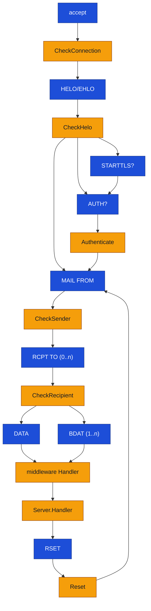

Go smtpd v2 [](https://pkg.go.dev/github.com/chrj/smtpd/v2)
========

Package `smtpd` implements an SMTP server in Go.

Versions
--------

| Version | Status | Branch | Tag | Docs |
|---------|--------|--------|-----|------|
| v1 | stable | [`v1`](https://github.com/chrj/smtpd/tree/v1) | [`v1.0.0`](https://github.com/chrj/smtpd/releases/tag/v1.0.0) | [godoc](https://pkg.go.dev/github.com/chrj/smtpd) |
| v2 | stable | [`main`](https://github.com/chrj/smtpd/tree/main) | [`v2.3.0`](https://github.com/chrj/smtpd/releases/tag/v2.3.0) | [godoc](https://pkg.go.dev/github.com/chrj/smtpd/v2) |

v1 is the original battle-tested API.

```go
import "github.com/chrj/smtpd"
```

v2 is a ground-up rewrite of the v1 API. It keeps the same wire behavior but
restructures the programming model around `context.Context`, a streaming
`Envelope`, structured logging, and composable middleware.

```go
import "github.com/chrj/smtpd/v2"
```

> [!NOTE]
> This README covers the v2 API only. [Click here for the v1 README](https://github.com/chrj/smtpd/tree/v1#go-smtpd--)

Features
--------

* STARTTLS and implicit TLS
* PLAIN/LOGIN authentication (after STARTTLS)
* Enhanced status codes ([RFC 3463](https://www.rfc-editor.org/rfc/rfc3463))
* `CHUNKING` with `BDAT`, and `BINARYMIME`
  ([RFC 3030](https://www.rfc-editor.org/rfc/rfc3030))
* DSN parameters ([RFC 3461](https://www.rfc-editor.org/rfc/rfc3461)), off by
  default
* `SMTPUTF8` for addresses of Unicode
  ([RFC 6531](https://www.rfc-editor.org/rfc/rfc6531)), off by default
* [XCLIENT](http://www.postfix.org/XCLIENT_README.html) and the
  [PROXY protocol](https://www.haproxy.org/download/1.8/doc/proxy-protocol.txt)
* Per-phase middleware: connection, HELO, MAIL FROM, RCPT TO, AUTH, DATA,
  RESET, DISCONNECT
* Streaming `Envelope.Data` as `io.ReadCloser` - no forced buffering
* `context.Context` threaded through every hook and handler
* Structured logging via `*slog.Logger`
* Context-aware `Shutdown(ctx)` that drains in-flight sessions
* Ready-made middleware in `github.com/chrj/smtpd/v2/middleware`: SPF, RBL,
  greylisting, per-IP rate limiting, `RequireAuth`, `RequireTLS`
* Test servers in `github.com/chrj/smtpd/v2/smtptest`, for end-to-end tests of
  an SMTP client

Quick start
-----------

A no-op server that accepts and discards:

```go
srv := &smtpd.Server{Logger: slog.Default()}
_ = srv.ListenAndServe(":25")
```

A relay with per-IP rate limiting, SPF, and `RequireTLS`:

```go
srv := &smtpd.Server{
    Hostname:  "mx.example.com",
    TLSConfig: tlsCfg,
    Logger:    slog.Default(),
    Handler:   forwardUpstream,
}

srv.Use(middleware.CheckConnection(middleware.IPAddressRateLimit(1, 10)))
srv.Use(middleware.CheckHelo(middleware.SPF().HeloCheck))
srv.Use(middleware.RequireTLS())

_ = srv.ListenAndServe(":25")
```

Architecture
------------

### Core types

| Type | Role |
|------|------|
| `Server` | Listener + configuration. Set fields, register middleware with `Use`, call `ListenAndServe` / `Serve`. |
| `Handler` | `func(ctx, peer, *Envelope) (ctx, error)` - the terminal delivery stage. |
| `Middleware` | Struct with optional per-phase hook fields. Any combination of fields may be set. |
| `Peer` | Connection-scoped state, populated progressively (`Addr` at connect, `HeloName` after HELO, `TLS` after handshake, `Username` after AUTH). Passed by value to every hook. |
| `Envelope` | Transaction-scoped state: `Sender`, `Recipients`, `Data io.ReadCloser`, `BodyType`, `DSN`. Passed by pointer so Handlers can mutate `Data`. |
| `Error` | `{Code, Enhanced, Message}` - returned from any hook to produce a specific SMTP reply. Non-`Error` errors are reported as `502`. |
| `EnhancedCode` | `[3]int` - the RFC 3463 status code that goes after the reply code, such as `{5, 7, 1}`. |

### Address form

`Envelope.Sender` and `Envelope.Recipients` hold an address in the form that
goes on the wire. An address with a quoted local part keeps its quoting, so a
relay can write the value into a command of its own.

| The client sends | The value |
| --- | --- |
| `MAIL FROM:<user@example.org>` | `user@example.org` |
| `MAIL FROM:<"a b"@example.org>` | `"a b"@example.org` |
| `MAIL FROM:<>` | `""` (the null sender) |
| `MAIL FROM:<jörg@example.org> SMTPUTF8` | `jörg@example.org` |

The server answers `501` for an address that carries a line break. An address
of Unicode needs `Server.EnableSMTPUTF8`. See [SMTPUTF8](#smtputf8).

### Delivery handlers

Message delivery is expressed with the `Handler` function type:

```go
type Handler func(ctx context.Context, peer Peer, env *Envelope) (context.Context, error)
```

`Server.Handler` is the terminal delivery step for an accepted message.
Middleware can also contribute a `Handler`; those run first, in `Use` order, as
pre-delivery stages that can inspect or replace `env.Data` before
`Server.Handler` runs.

### The `Middleware` value

`Middleware` is a struct of optional function fields - one per SMTP phase. A
middleware only "participates" in phases whose field it sets:

```go
type Middleware struct {
    CheckConnection func(ctx, peer) (ctx, error)
    CheckHelo       func(ctx, peer, name) (ctx, error)
    CheckSender     func(ctx, peer, addr) (ctx, error)
    CheckRecipient  func(ctx, peer, addr) (ctx, error)
    Authenticate    func(ctx, peer, user, pass) (ctx, error)
    Handler         Handler                              // pre-deliver stage
    Reset           func(ctx, peer) ctx
    Disconnect      func(ctx, peer, err error)
}
```

`Server.Use` appends every non-nil field to the matching per-phase list. At
runtime, the server walks each list in `Use` order; the first non-nil error
short-circuits the phase and is returned to the client. `Server.Handler` (the
terminal delivery function) runs after all middleware `Handler` stages succeed.

### Context flow

Each accepted connection gets its own `context.Context`, derived from
`Server.BaseContext` / `Server.ConnContext`. It:

* is cancelled when the connection closes or `Shutdown` is called
* carries a per-connection `*slog.Logger` retrievable with `LoggerFromContext`
* carries the current MAIL FROM via `SenderFromContext` (useful inside
  `CheckRecipient`, e.g. for greylisting)
* is returned from every checker, so middleware can install its own values
  for later stages using `context.WithValue`

### Logging and credentials

At the `DEBUG` level the server writes every line it receives and every reply
it sends. The credentials of an `AUTH` command do not go to the log: the
server keeps the verb and the mechanism, and replaces the rest.

```
level=DEBUG msg=received peer=10.0.0.7:52344 line="AUTH PLAIN [redacted]"
```

The other form of `AUTH` sends the credentials on their own lines, after a
`334` reply. The server reads those lines directly, so they never reach the
log.

`Peer.Username` holds the user name after a successful `AUTH`. The password is
given to the `Authenticate` hooks and is not kept.

### Session lifecycle


```mermaid
flowchart TD
    accept["accept"] --> checkConnection["CheckConnection"]
    checkConnection --> helo["HELO/EHLO"]
    helo --> checkHelo["CheckHelo"]
    checkHelo --> starttls["STARTTLS?"]
    checkHelo --> auth["AUTH?"]
    starttls --> auth
    checkHelo --> mailFrom["MAIL FROM"]
    auth --> authenticate["Authenticate"]
    authenticate --> mailFrom
    mailFrom --> checkSender["CheckSender"]
    checkSender --> rcptTo["RCPT TO (0..n)"]
    rcptTo --> checkRecipient["CheckRecipient"]
    checkRecipient --> data["DATA"]
    checkRecipient --> bdat["BDAT (1..n)"]
    data --> middlewareHandler["middleware Handler"]
    bdat --> middlewareHandler
    middlewareHandler --> serverHandler["Server.Handler"]
    serverHandler --> rset["RSET"]
    rset --> resetHook["Reset"]
    resetHook --> mailFrom

    classDef phase fill:#1d4ed8,stroke:#1e3a8a,color:#ffffff;
    classDef hook fill:#f59e0b,stroke:#92400e,color:#111827;

    class accept,helo,starttls,auth,mailFrom,rcptTo,data,bdat,rset phase;
    class checkConnection,checkHelo,authenticate,checkSender,checkRecipient,middlewareHandler,serverHandler,resetHook hook;
```

Blue boxes are SMTP phases; amber boxes are middleware hooks. The `Envelope`
is created at `MAIL FROM`, grows across `RCPT TO`, gets `Data` at `DATA` or at
the first `BDAT`, and is cleared after delivery or `RSET`.

The handlers start as soon as the message does, and `Data` streams the rest to
them, both for `DATA` and for `BDAT`. The two differ in where they run: the
handlers of a `DATA` message hold the session while they read, and the
handlers of a `BDAT` message run on a goroutine of their own while the session
reads the commands that carry the chunks.

`Disconnect` always runs exactly once per session. `err` is nil on clean
shutdown (QUIT or server `Shutdown`); non-nil if a TLS/read/DATA error
terminated the session, or a `PanicError` if a hook panicked.

### STARTTLS

Everything the client sends before the handshake goes over the wire in plain
text, where anybody on the path can change it. RFC 3207 says the server must
drop what it learned there, so a successful `STARTTLS` clears `Peer.HeloName`,
`Peer.Protocol` and `Peer.Username`, and the envelope.

The client must send `EHLO` or `HELO` again. Without it, `MAIL FROM` is
answered with `503`. Client libraries do this for themselves: `StartTLS` in
`net/smtp` sends `EHLO` again as part of the call.

Commands that arrive in the same write as `STARTTLS` never run. The session
builds a new reader on the TLS connection, so the bytes that were read into
the buffer with `STARTTLS` are dropped.

### XCLIENT

Set `Server.EnableXCLIENT` to let a proxy in front of the server give the
identity of the client it took the connection from. `ADDR` and `PORT` replace
`Peer.Addr`, `HELO` replaces `Peer.HeloName`, `LOGIN` replaces
`Peer.Username`, and `PROTO` replaces `Peer.Protocol`.

Turn this on only where a proxy you trust reaches the server. The command
gives the client any identity it asks for, and middleware such as the
greylist, the RBL check and the rate limit all read `Peer.Addr`.

Attribute values arrive in the xtext encoding of RFC 1891, where `+` starts a
byte written as two hexadecimal digits. The server decodes them, so
`LOGIN=user+40example.com` gives `user@example.com`. A `+` that two such
digits do not follow stands for itself, so a value that the proxy sent without
encoding still arrives whole.

The values `[UNAVAILABLE]` and `[TEMPUNAVAIL]` say that the proxy has no
information for that attribute, and leave it as it was.

### CHUNKING and BDAT

The server takes a message in chunks with the `BDAT` command of
[RFC 3030](https://www.rfc-editor.org/rfc/rfc3030). It offers `CHUNKING` and
`BINARYMIME` in the reply to `EHLO`, and there is nothing to turn on.

```
C: BDAT 24
S: 250 2.0.0 24 octets received
C: BDAT 12 LAST
S: 250 2.0.0 Message OK, 36 octets received
```

The octets of a chunk follow the command line on the same stream. They carry
no dot stuffing and no line structure, so the body reaches the handler as the
client sent it. A line with one dot on it is part of the message, where the
same line ends a `DATA` message.

`Envelope.Data` streams the chunks as they arrive. The handler starts with the
first chunk and reads the message through the rest of the transfer, in the same
way as for a `DATA` message, so a chunked message is never held in memory as a
whole. The server runs it on a goroutine of its own and waits for it at
`BDAT LAST`.

A transfer that ends before the last chunk gives the handler an error in the
place of the rest of the message. `RSET` does that, and so does a connection
that closes in the middle. Half a message therefore never looks whole to a
handler.

| The client sends | The server answers |
| --- | --- |
| `BDAT` before `RCPT TO` | `503`, after it read the chunk off the wire |
| a chunk that takes the message past `MaxMessageSize` | `552`, and every chunk after it gets the same answer |
| `DATA` after `BDAT` in one transaction | `503` |
| `DATA` for a `BODY=BINARYMIME` message | `503` |
| `RCPT TO` after the first chunk | `503` |
| `BDAT` with a chunk size that is not a number | `501`, and the connection closes |

A refused chunk still comes off the wire, which is what RFC 3030 asks for: a
chunk that stays there is read as commands. The one command that closes the
connection is a `BDAT` whose size cannot be read, because nothing then says
where the chunk ends.

`Envelope.BodyType` holds the `BODY` parameter of `MAIL FROM`: `7BIT`,
`8BITMIME` or `BINARYMIME`. It is empty when the client sent no such
parameter. A `BINARYMIME` message needs `BDAT`, so `DATA` answers `503` for
one.

### DSN

Set `Server.EnableDSN` to offer the DSN extension of
[RFC 3461](https://www.rfc-editor.org/rfc/rfc3461). The server reads four
parameters and puts them on `Envelope.DSN`.

| Command | Parameter | Field |
| --- | --- | --- |
| `MAIL FROM` | `RET` | `DSN.Return` |
| `MAIL FROM` | `ENVID` | `DSN.EnvID` |
| `RCPT TO` | `NOTIFY` | `DSN.Recipients[i].Notify` |
| `RCPT TO` | `ORCPT` | `DSN.Recipients[i].OriginalRecipient` and `.OriginalType` |

`DSN.Recipients` holds one entry for each address in `Envelope.Recipients`, at
the same index. A recipient that came with no parameter of its own has the
zero value there. `Envelope.DSN` is nil when the client sent none of the four
parameters.

```go
srv := &smtpd.Server{
    EnableDSN: true,

    Handler: func(ctx context.Context, peer smtpd.Peer, env *smtpd.Envelope) (context.Context, error) {
        defer func() { _ = env.Data.Close() }()

        if env.DSN != nil {
            for i, addr := range env.Recipients {
                rcpt := env.DSN.Recipients[i]
                if rcpt.Notify&smtpd.DSNNotifyNever != 0 {
                    log.Printf("%s asks for no notification", addr)
                }
            }
        }

        return ctx, deliver(env)
    },
}
```

The server writes no notification of its own. It carries the request to the
handler, which knows what became of the message. A relay passes the parameters
on to the next server, and a mailbox store writes the notification.

`DSNNotify` is a set of events, and `String` writes it back in the form that
the parameter takes, such as `SUCCESS,DELAY`.

The extension is off by default. A server that offers it tells the client that
a notification follows the request. Without `EnableDSN`, the server answers
`555` to each of the four parameters.

The values of `ENVID` and `ORCPT` arrive in the xtext encoding of RFC 3461,
where `+` starts a byte written as two hexadecimal digits. The server decodes
them, so `ENVID=QQ+40314159` gives `QQ@314159`. A value that breaks the
encoding gets a `501` reply, and so does a byte outside printable US-ASCII.
That check keeps a line break out of the command that a relay writes next.

An `ORCPT` of the `utf-8` address type carries an address of Unicode, and it
takes the encoding of
[RFC 6533](https://www.rfc-editor.org/rfc/rfc6533) instead, where `\x{HEX}`
holds one code point. A server with `Server.EnableSMTPUTF8` decodes that one
too, so `ORCPT=utf-8;j\x{00F6}rg@example.net` gives `jörg@example.net`. A
transaction with the `SMTPUTF8` parameter takes the bytes of the address as
they came, and every other one needs the escape.

Without `EnableSMTPUTF8`, the server reads the value as ordinary xtext, in the
way that it did before, and the escape reaches the handler as it came. RFC
6531 section 3.2 asks for the address type from a server that offers `DSN`
next to `SMTPUTF8`, and this one offers neither.

### SMTPUTF8

Set `Server.EnableSMTPUTF8` to offer the SMTPUTF8 extension of
[RFC 6531](https://www.rfc-editor.org/rfc/rfc6531). A client that sends the
`SMTPUTF8` parameter with `MAIL FROM` can then write an address of Unicode in
UTF-8, in the local part and in the domain. The server offers `8BITMIME` next
to the keyword, which RFC 6531 section 3.1 asks for.

```
C: MAIL FROM:<jörg@example.org> SMTPUTF8
S: 250 2.1.0 Go ahead
C: RCPT TO:<用户@例子.广告>
S: 250 2.1.5 Go ahead
```

The parameter takes no value, and `Envelope.SMTPUTF8` tells the handler that
the transaction carried it. The message itself can hold headers in UTF-8, and
the server streams it as it does every other message.

```go
srv := &smtpd.Server{
    EnableSMTPUTF8: true,

    Handler: func(ctx context.Context, peer smtpd.Peer, env *smtpd.Envelope) (context.Context, error) {
        defer func() { _ = env.Data.Close() }()

        if env.SMTPUTF8 {
            log.Printf("an internationalized message from %s", env.Sender)
        }

        return ctx, deliver(env)
    },
}
```

The extension is off by default. A server that offers it says that it carries
such a message onward, and the next server on the way has to offer the
extension as well. Turn it on where the handler keeps the message, or where it
relays to a server that takes one.

A server that offers the extension holds every other transaction to US-ASCII.
RFC 6531 section 3.5 gives the two replies:

| The client sends | The reply |
| --- | --- |
| `MAIL FROM:<jörg@example.org>` | `550 5.6.7` |
| `RCPT TO:<用户@example.net>` | `553 5.6.7` |

An address in such a transaction has to be UTF-8. A byte outside that encoding
gets a `501` reply.

Without `EnableSMTPUTF8`, the server answers `555` to the parameter and reads
an address as it did before.

The server looks up no domain of its own, so it keeps an address as the client
wrote it. A domain of Unicode reaches the handler and the middleware in the
U-label form. RFC 6531 section 3.2 asks the party that looks a domain up in
the DNS to convert it to the A-label form first, which the SPF middleware and
a handler that relays the message have to do. Read
[RFC 5890](https://www.rfc-editor.org/rfc/rfc5890) for the two forms.

### Panics

A panic in `Server.Handler` or in a middleware hook stops that session only.
The server writes the panic and the stack trace to the log at the `ERROR`
level, replies `421`, and closes the connection. Other sessions continue.

The `Disconnect` hooks receive the panic as a `smtpd.PanicError`. `Value`
holds the value given to `panic` and `Stack` holds the stack trace:

```go
smtpd.Middleware{
    Disconnect: func(ctx context.Context, peer smtpd.Peer, err error) {
        var panicErr smtpd.PanicError
        if errors.As(err, &panicErr) {
            report(peer.Addr, panicErr.Value, panicErr.Stack)
        }
    },
}
```

A panic in a `Disconnect` hook is contained the same way, but it cannot
reach a hook, so the server only writes it to the log.

`BaseContext` and `ConnContext` run in the accept loop, not in a session, so
they behave differently:

| Hook | On a panic |
| --- | --- |
| `BaseContext` | `Serve` returns a `PanicError`. The hook runs once, before the accept loop, so the server never starts. |
| `ConnContext` | The server writes the panic to the log, drops that connection, and keeps accepting. |

Writing a handler
-----------------

`Server.Handler` is the delivery step:

```go
func deliver(ctx context.Context, peer smtpd.Peer, env *smtpd.Envelope) (context.Context, error) {
    defer env.Data.Close()

    body, err := io.ReadAll(env.Data)
    if err != nil {
        return ctx, err
    }

    if err := store.Save(ctx, env.Sender, env.Recipients, body); err != nil {
        return ctx, smtpd.Error{Code: 451, Message: "temporary failure, try again"}
    }
    return ctx, nil
}

srv := &smtpd.Server{Handler: deliver}
```

Notes:

* `env.Data` is a stream over the connection. It is valid only for the
  duration of the call. Fully consume it, or stream it through `io.Copy`.
  The server drains and closes it after you return, to keep the SMTP
  protocol in sync.
* Returning an `smtpd.Error` lets you pick the reply code; any other error
  becomes `502`.
* Set `Enhanced` on the error to give the client a precise reason. An error
  that leaves it out takes the generic code for its class, such as `5.0.0`.
  See [Enhanced status codes](#enhanced-status-codes).
* The returned context replaces the session context for any subsequent
  commands on the connection.

Enhanced status codes
---------------------

The server offers `ENHANCEDSTATUSCODES` and writes the status code of
[RFC 3463](https://www.rfc-editor.org/rfc/rfc3463) after the reply code:

```
250 2.1.5 Go ahead
550 5.7.1 Relay access denied
452 4.5.3 Too many recipients
```

Set the code on the error that your hook returns:

```go
return ctx, smtpd.Error{
    Code:     550,
    Enhanced: smtpd.EnhancedCode{5, 7, 1},
    Message:  "Relay access denied",
}
```

`Enhanced` is optional. An error that leaves it out takes the generic code
for the class of `Code`, which RFC 3463 section 3.1 writes as `x.0.0`. The
example above sends `550 5.0.0 Relay access denied` without the `Enhanced`
field.

The server leaves the status code out in three places, because
[RFC 2034](https://www.rfc-editor.org/rfc/rfc2034) does:

* The greeting, which the client reads before it sends a command.
* The reply to `HELO` and to `EHLO`.
* Every reply to a client that sent `HELO`. Such a client never saw the
  server offer the extension, so it gets the replies of RFC 5321.

RFC 3463 defines no status class for a `1yz` or a `3yz` reply, so the `354`
of `DATA` and the `334` of `AUTH` also stay as they were.

The middleware in `middleware` sets a code for each of its refusals:

| Middleware | Reply |
| --- | --- |
| `RequireAuth` | `530 5.7.0 Authentication required` |
| `RequireTLS` | `530 5.7.0 Must issue STARTTLS first` |
| `Greylist` | `450 4.7.1 greylisted, try again later` |
| `IPAddressRateLimit` | `450 4.7.1 rate-limited, try again later` |
| `RBL` | `554 5.7.1 {list message}` |
| `SPF` (fail) | `550 5.7.23 SPF check failed` |
| `SPF` (temporary error) | `451 4.7.24 SPF check temporary error` |
| `SPF` (permanent error) | `550 5.7.24 SPF check permanent error` |

The SPF codes come from [RFC 7372](https://www.rfc-editor.org/rfc/rfc7372).

Writing middleware
------------------

A middleware is just a `smtpd.Middleware` value. Set the fields for the phases
you participate in, leave the rest nil:

```go
func rejectNullSender() smtpd.Middleware {
    return smtpd.Middleware{
        CheckSender: func(ctx context.Context, peer smtpd.Peer, addr string) (context.Context, error) {
            if addr == "" {
                return ctx, smtpd.Error{Code: 550, Message: "Null sender not accepted"}
            }
            return ctx, nil
        },
    }
}

srv.Use(rejectNullSender())
```

### Lifting plain check functions

For single-phase checks, the `middleware` sub-package defines three function
signatures and matching adapters that turn them into a `smtpd.Middleware`:

```go
type PeerCheck func(ctx, peer) error                 // Connect, Helo
type AddrCheck func(ctx, peer, addr) error           // MailFrom, RcptTo
type DataCheck func(ctx, peer, env) error            // post-DATA
```

```go
srv.Use(middleware.CheckConnection(myPeerCheck))
srv.Use(middleware.CheckSender(mySenderCheck))
srv.Use(middleware.CheckData(myDataCheck))
```

This is the pattern used by built-ins like `SPF`, `RBL`, and `Greylist`, which
expose check methods you can wire to any compatible phase.

### Mutating the envelope

A middleware-level `Handler` runs as a pre-deliver stage: after DATA is
received, before `Server.Handler`. Use it to rewrite or enrich the message.
This is also the v2 replacement for v1's `Envelope.AddReceivedLine`:

```go
func addReceivedHeader() smtpd.Middleware {
    return smtpd.Middleware{
        Handler: func(ctx context.Context, peer smtpd.Peer, env *smtpd.Envelope) (context.Context, error) {
            body, err := io.ReadAll(env.Data)
            if err != nil {
                return ctx, err
            }

            header := fmt.Sprintf(
                "Received: from %s by %s; %s\r\n",
                peer.Addr.String(),
                peer.ServerName,
                time.Now().UTC().Format(time.RFC1123Z),
            )

            env.Data = io.NopCloser(bytes.NewReader(append([]byte(header), body...)))
            return ctx, nil
        },
    }
}

srv.Use(addReceivedHeader())
```

### Propagating values through context

Every checker returns a `context.Context`. To pass data to later stages,
return a derived context:

```go
CheckHelo: func(ctx context.Context, peer smtpd.Peer, name string) (context.Context, error) {
    return context.WithValue(ctx, traceIDKey{}, uuid.NewString()), nil
}
```

Testing
-------

The sub-package `github.com/chrj/smtpd/v2/smtptest` runs a real server on the
loopback interface, so a test can drive an SMTP client end to end. It follows
`net/http/httptest`. A setup fault that a test cannot correct causes a panic,
and the caller must call `Close`.

```go
import "github.com/chrj/smtpd/v2/smtptest"
```

| Function | Transport |
|----------|-----------|
| `NewServer` | Plain SMTP. |
| `NewSTARTTLSServer` | Plain SMTP, with STARTTLS in the reply to EHLO. |
| `NewTLSServer` | TLS before the greeting, as SMTPS on port 465. |
| `NewUnstartedServer` | None yet. Change `Config` or `TLS`, then call a `Start` method. |

A `Recorder` is an `smtpd.Handler` that keeps the messages that it receives:

```go
rec := &smtptest.Recorder{}
srv := smtptest.NewSTARTTLSServer(rec.Handler)
defer srv.Close()

sendWithTheClientUnderTest(srv.Addr, srv.ClientTLSConfig())

if got := rec.Messages()[0].Sender; got != "sender@example.org" {
    t.Errorf("Sender: got %q, want %q", got, "sender@example.org")
}
```

The server gives its address in three forms. `Addr` is the "host:port" pair
for `net.Dial`. `Host` and `Port` are the two parts, for a client that takes
them apart, and `Host` is also the name that `smtp.PlainAuth` expects.

### Dial

`Dial` opens a connection and returns a `*smtp.Client` that completed the
handshake of the transport. It sends STARTTLS to a STARTTLS server, and it
does the TLS handshake before the greeting for an implicit TLS server:

```go
c := srv.Dial()
defer func() { _ = c.Quit() }()

if err := c.Auth(smtp.PlainAuth("", "joe", "secret", srv.Host)); err != nil {
    t.Fatalf("AUTH: %v", err)
}
```

Each call opens one connection. Use `Dial` for the parts of a test that only
need a working client. A client library under test connects to `Addr`
itself.

If the server stopped, `Dial` panics with the reason from `Serve`. A test
with a bad configuration reads that reason instead of a dial error.

`Close` waits five seconds for the sessions that are still open, then closes
their connections and writes one line to stderr. A test that ends with a
connection open is the usual cause, so `Close` does not fail for it.

### Send and Cmd

`Send` runs one transaction on a client: MAIL FROM, RCPT TO, DATA and QUIT.
It returns the first error, so a test can read the reply code of a
rejection:

```go
err := smtptest.Send(srv.Dial(), "sender@example.org",
    []string{"recipient@example.net"}, "Subject: hello\r\n\r\nbody\r\n")

var reply *textproto.Error
if !errors.As(err, &reply) || reply.Code != 550 {
    t.Errorf("RCPT TO error: got %v, want 550", err)
}
```

`Cmd` sends one raw command and compares the reply code. Use it for a
command that `net/smtp` does not send, such as XCLIENT or PROXY, or for bad
syntax:

```go
if err := smtptest.Cmd(c.Text, 550, "XCLIENT NAME=ignored"); err != nil {
    t.Errorf("XCLIENT: %v", err)
}
```

Both take a `*smtp.Client`, and not a `*smtptest.Server`. A test of your own
SMTP server can use them against a server that this package did not start.

### Certificates

Both TLS servers present a self-signed certificate for `localhost`,
`127.0.0.1` and `::1`. Three methods pass it to the client under test:

* `ClientTLSConfig()` returns a `*tls.Config` that trusts the server.
* `Certificate()` returns the parsed `*x509.Certificate`.
* `CertPEM()` returns the certificate in PEM form, for a client that reads a
  trust anchor from a file.
* `KeyPEM()` returns the private key in PEM form. With `CertPEM` it makes the
  pair that a server under test loads from two files.

To present your own certificate, set `TLS` before a `Start` method. The
`Start` methods keep that certificate and add the default one only when the
configuration holds none.

```go
srv := smtptest.NewUnstartedServer(rec.Handler)
srv.TLS = &tls.Config{Certificates: []tls.Certificate{expiredCert}}
srv.StartSTARTTLS()
defer srv.Close()
```

### Recording in front of a real handler

`Recorder.Handler` reads the body into memory and then puts an equal stream
back on `env.Data`. A stage that runs after it reads the same bytes, so the
`Recorder` also works in front of the delivery handler under test:

```go
srv := smtptest.NewUnstartedServer(deliveryHandlerUnderTest)
srv.Config.Use(smtpd.Middleware{Handler: rec.Handler})
srv.Start()
defer srv.Close()
```

### A listener of your own

The server accepts on a TCP listener of the loopback interface, because most
SMTP clients take an address and not a connection. A test that needs another
transport, such as an in-memory pipe, replaces `Listener` before a `Start`
method:

```go
srv := smtptest.NewUnstartedServer(rec.Handler)
srv.Listener = myListener
srv.Start()
defer srv.Close()
```

Such a listener gives no TCP address. `Host` and `Port` stay empty and zero,
`Peer.Addr` no longer identifies the client, and `Dial` cannot open the
connection for you.

Migration guide - v1 → v2
--------------------------

The wire behavior is unchanged. The Go API changed significantly. Minimum
required Go version is 1.25.

### 1. Import path

```go
// v1
import "github.com/chrj/smtpd"

// v2
import "github.com/chrj/smtpd/v2"
```

### 2. `Handler` signature

`Handler` is now context-aware, takes an `*Envelope` (so it can replace
`Data`), and returns the context back.

```go
// v1
Handler: func(peer smtpd.Peer, env smtpd.Envelope) error { ... }

// v2
Handler: func(ctx context.Context, peer smtpd.Peer, env *smtpd.Envelope) (context.Context, error) { ... }
```

### 3. `Envelope.Data` is a stream

```go
// v1
body := env.Data   // []byte, already buffered

// v2
body, err := io.ReadAll(env.Data)
// or: io.Copy(dst, env.Data) to stream without buffering
```

For DKIM / content inspection, read it once; for relay, stream it directly
into the upstream writer.

### 4. `Envelope.AddReceivedLine` → middleware `Handler`

v1's helper was removed along with the old buffered `Envelope.Data`. In v2,
inject the `Received:` line in a middleware `Handler`, then replace `env.Data`
with a new reader:

```go
srv.Use(addReceivedHeader())
```

The `addReceivedHeader` example above is the direct compatibility pattern.

### 5. Checkers are now middleware

The four checker fields (`ConnectionChecker`, `HeloChecker`, `SenderChecker`,
`RecipientChecker`) and `Authenticator` have been removed from `Server`. Use
`srv.Use(smtpd.Middleware{...})`:

```go
// v1
srv := &smtpd.Server{
    HeloChecker:   checkHelo,
    SenderChecker: checkSender,
    Authenticator: authFn,
}

// v2
srv := &smtpd.Server{}
srv.Use(smtpd.Middleware{
    CheckHelo: func(ctx context.Context, peer smtpd.Peer, name string) (context.Context, error) {
        return ctx, checkHelo(peer, name)
    },
    CheckSender: func(ctx context.Context, peer smtpd.Peer, addr string) (context.Context, error) {
        return ctx, checkSender(peer, addr)
    },
    Authenticate: func(ctx context.Context, peer smtpd.Peer, u, p string) (context.Context, error) {
        return ctx, authFn(peer, u, p)
    },
})
```

Or, for single-phase checks, use the lifting adapters from the `middleware`
package: `middleware.CheckHelo`, `middleware.CheckSender`, etc.

### 6. `AuthOptional` → `RequireAuth`

Registering an authenticator no longer implicitly enforces AUTH. Opt in:

```go
// v1
srv.Authenticator = authFn
srv.AuthOptional = false   // enforced at MAIL FROM

// v2
srv.Use(middleware.Authenticator(authFn))
srv.Use(middleware.RequireAuth())                        // MAIL FROM (default)
srv.Use(middleware.RequireAuthAt(middleware.AuthAtData)) // or pick a stage
```

### 7. `ForceTLS` → `RequireTLS`

```go
// v1
srv.TLSConfig = tlsCfg
srv.ForceTLS  = true

// v2
srv.TLSConfig = tlsCfg
srv.Use(middleware.RequireTLS())
```

### 8. `ProtocolLogger` → `Logger`

```go
// v1
srv.ProtocolLogger = log.New(os.Stderr, "", log.LstdFlags)

// v2
srv.Logger = slog.New(slog.NewTextHandler(os.Stderr, nil))
```

Per-connection loggers are exposed to middleware via
`smtpd.LoggerFromContext(ctx)`.

### 9. `Shutdown(wait)` + `Wait()` → `Shutdown(ctx)`

```go
// v1
_ = srv.Shutdown(true)

// v2
ctx, cancel := context.WithTimeout(context.Background(), 30*time.Second)
defer cancel()
_ = srv.Shutdown(ctx)
```

### 10. `Peer.Password` removed

The password is still delivered to the `Authenticate` hook, but is no longer
stored on `Peer`. If you need it beyond the AUTH step, stash whatever you
need in the returned context.

### 11. Behavior differences worth testing

* A failed STARTTLS handshake now closes the connection (v1 continued the
  session in cleartext). The failure is reported through the `Disconnect`
  hook's `err` argument.
* `smtpd.Error` renders to `"{Code} {Message}"`, or to
  `"{Code} {Enhanced} {Message}"` when you set `Enhanced` -
  `errors.Is`/`errors.As` work as expected on it.
* A client that sends `EHLO` now gets the status codes of RFC 3463 on every
  reply. A test that asserts on the text of a reply must expect them. A
  client that sends `HELO` sees no change.
* `Reset` and `Disconnect` middleware hooks are new in v2.

Feedback
--------

Reach the author at [christian@technobabble.dk](mailto:christian@technobabble.dk).
